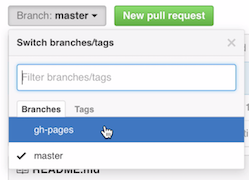
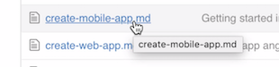
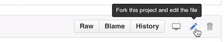
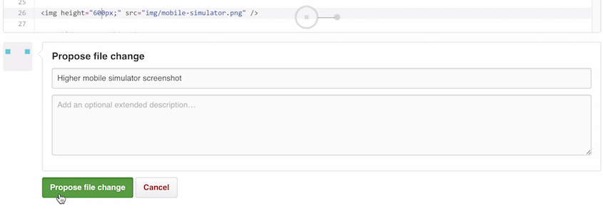
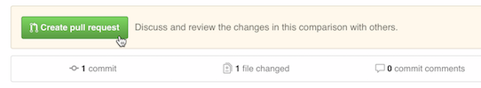
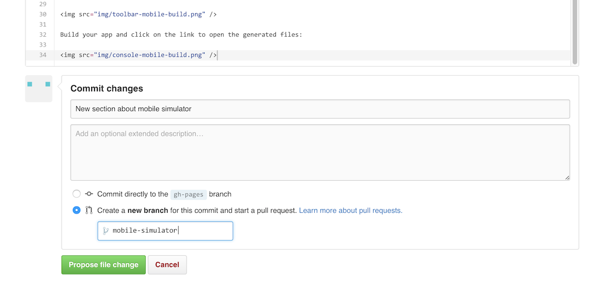
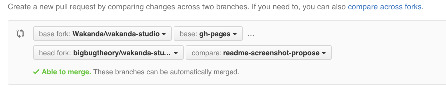

# Getting Started website

## How to contribute?

### Table of contents

- [Your first contribution, without leaving your browser](#your-first-contribution)
- [Further contributions](#further-contributions)
- [Submit pictures](#submit-pictures)

### Your first contribution

[Sign in](https://github.com/login) to your Github account.

[On the Wakanda Studio repository](https://github.com/Wakanda/wakanda-studio), make sure you are on the [gh-pages](https://github.com/Wakanda/wakanda-studio/tree/gh-pages) branch:

Open the page you want to contribue to:

Click on the file edition button. It will automatically fork the project in your Github account:

Edit the file content and propose a file change:

Create a pull request:

Add a short comment to explain the update you propose and confirm.

Thanks for your first contribution. We'll now review your submission!

### Further contributions

Open the Wakand Studio repository now forked on your Github account: `https://github.com/YOUR-USERNAME/wakanda-studio`

As seen above:

- 1/ make sure you are on the `gh-pages` branch
- 2/ open the file to edit
 
Start a pull request, checking the _create a new branch_ option:

### Submit pictures

You can't submit a picture via the Github web interface. So, let's use the command line:

Clone your wakanda-studio fork:

    $ git clone https://github.com/YOUR-USERNAME/wakanda-studio.git
    $ cd wakanda-studio

Switch to the `gh-pages` branch:

    $ git checkout origin/gh-pages -t

Add your image in the `img` folder of wakanda-studio. And commit your update:

    $ git add img/readme-propose-file-change.png
    $ git commit -m "Add propose file change screenshot for README"
  
Push your local changes on `gh-pages` to a new remote branch. For example, `readme-screenshot-propose`:

    $ git push origin gh-pages:readme-screenshot-propose

Open the Wakand Studio repository forked on your Github account: `https://github.com/YOUR-USERNAME/wakanda-studio`

Your new branch is ready for a pull request! Click on _Compare & pull request_:

 

Make sure the _base branch_ is `gh-pages`:

 

Add a short comment to explain the update you propose and confirm. Thank you again!